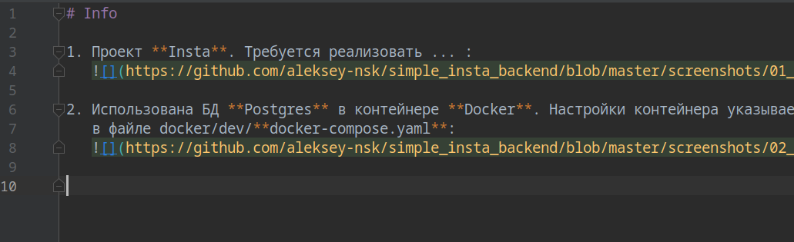

# Info

1. Проект **Insta**. Требуется реализовать ... :    
     

2. Использована БД **Postgres** в контейнере **Docker**. Настройки контейнера указываем  
   в файле docker/dev/**docker-compose.yaml**:  
   
   
