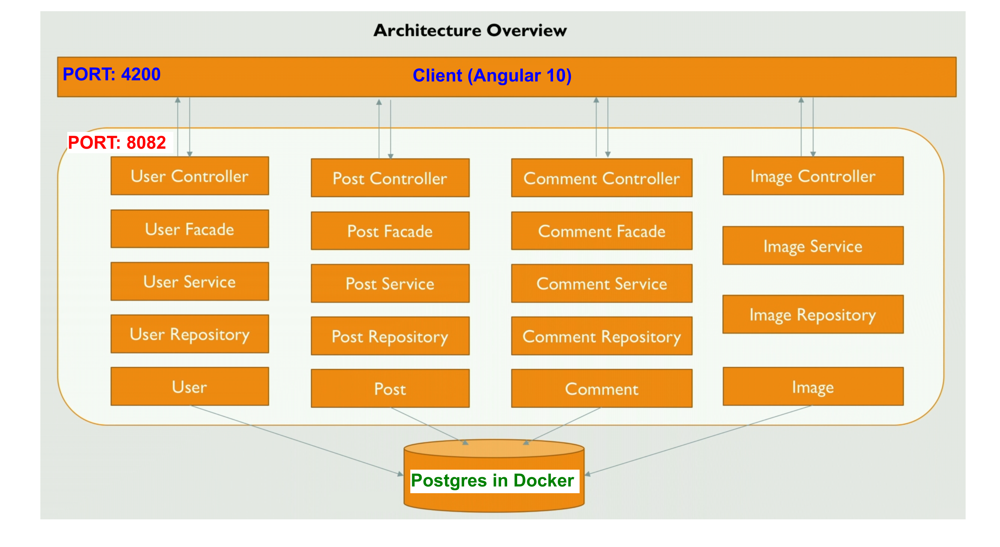
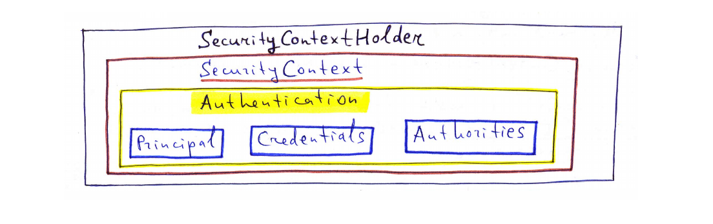
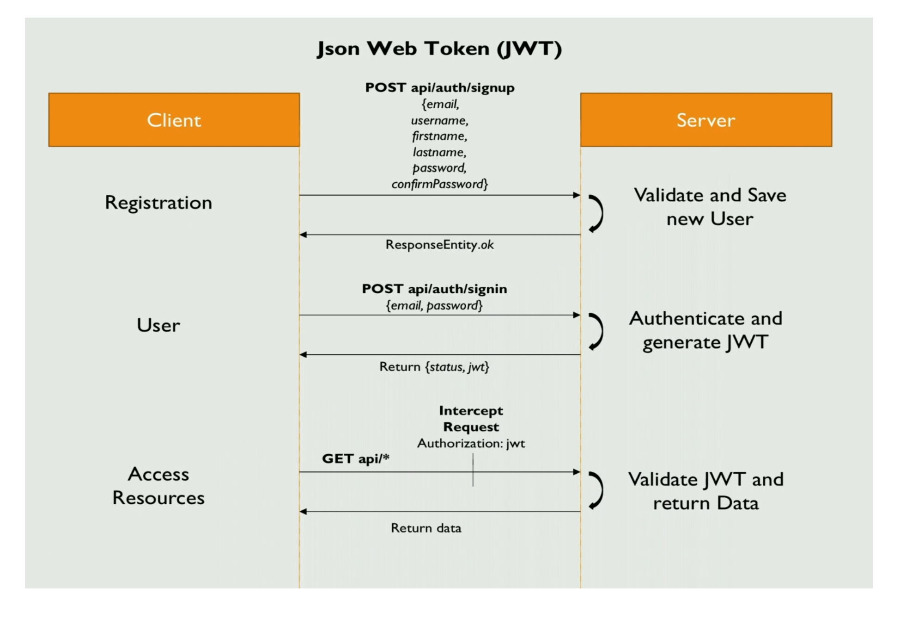
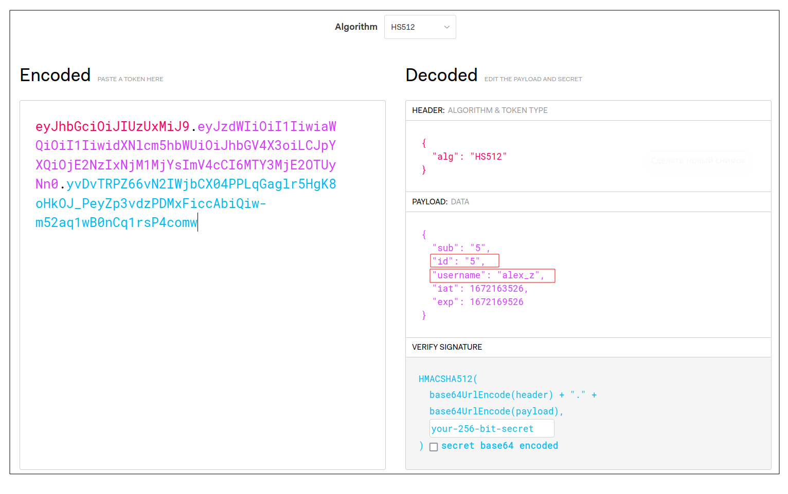

# Info

Учебная задача **Simple Instagram**.  
Проект состоит из репозиториев:  
- Backend (данный репозиторий)  
- [Frontend](https://github.com/aleksey-nsk/simple-insta-frontend)  

# Backend

1. Архитектура приложения:  
   

2. Бэкенд реализован в виде **Spring Boot REST API**. Список реализованных **эндпоинтов**:    
   
      
3. Для миграций используем **Liquibase**. Создаём следующую структуру таблиц:    
   
   
4. Реализуем **регистрацию** новых пользователей и **аутентификацию** с помощью **Spring Security**   
   и **JWT-токенов**.
   
При успешной аутентификации объект типа **Authentication** сохраняется в **SecurityContext**, а тот в свою
очередь - в **SecurityContextHolder**:    
  

Текущего пользователя из SecurityContextHolder можно получить так:  

    SecurityContext context = SecurityContextHolder.getContext();
    Authentication authentication = context.getAuthentication();
    UserDetails principal = (UserDetails) authentication.getPrincipal();

таким образом SecurityContext используется для хранения объекта Authentication.

Здесь:  
- `Principal` - содержит инфу про юзера. 
- `Credentials` - содержит пароль.
- `Authorities` - содержит права (`ROLE_USER`, и т.д.)

Для работы с JWT-токенами используем **библиотеку JJWT** (Java JWT: JSON Web Token for Java and Android).
Схема работы с библиотекой такая:  
  

Если декодировать полученный токен на сайте https://jwt.io/, то в нём видны **клеймы**:  
- `id`;  
- `username`;   
  
  
5. Полученный backend тестируем с помощью **Postman**:  
     
